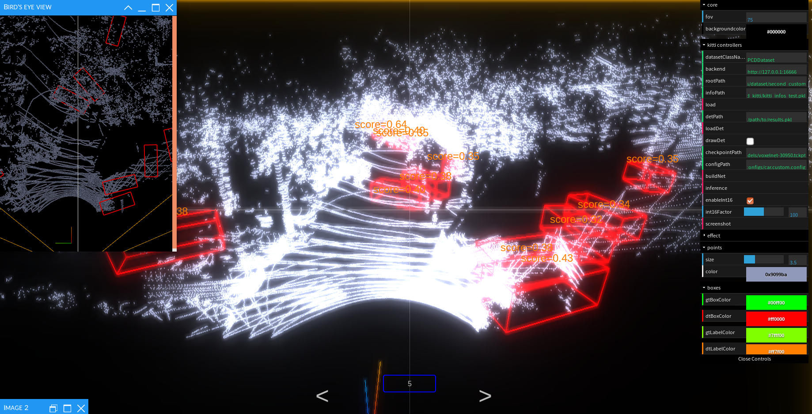

# SECOND for KITTI object detection

This is a ROS version for SECOND--a net for 3D Object detection. Origin ver is [here](https://github.com/traveller59/second.pytorch)

Thanks for [traveller59](https://github.com/traveller59)

## update recode 

* 4-2 

  Succeed to display pcd file.Continue to construct ros ver.
  

* 4-1
  
  The author released SECOND1.6 for applying the net into custom point cloud.
  
  Update my code too.

## dependence

* [python-pcl](https://github.com/strawlab/python-pcl)

## usage

### PCD dataset.

should rename each pcd file into 1.pcd, 2.pcd, 3.pcd....(To be described)

## TODO

- [ ] Predict single point cloud file.
- [ ] ROS msg to tensor.
- [ ] Custom point cloud apply.
